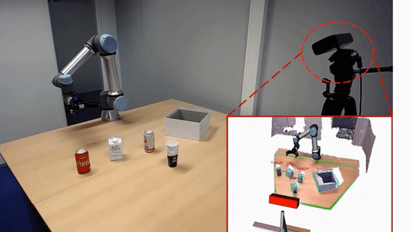
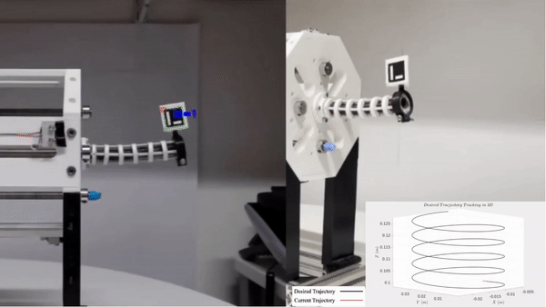
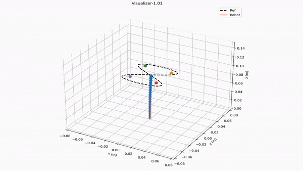
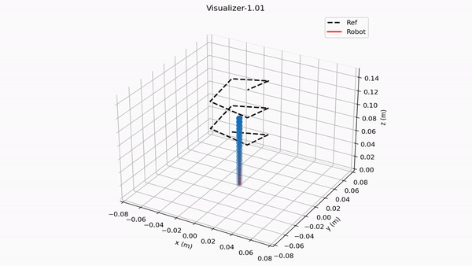
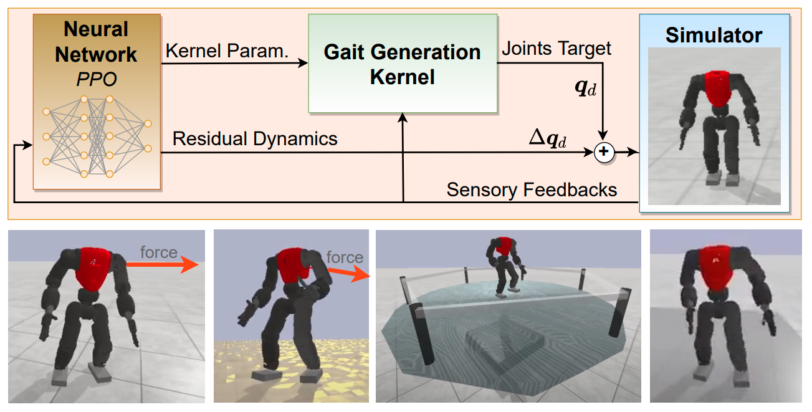
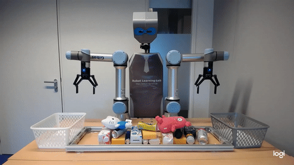
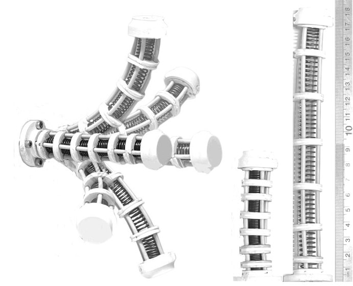
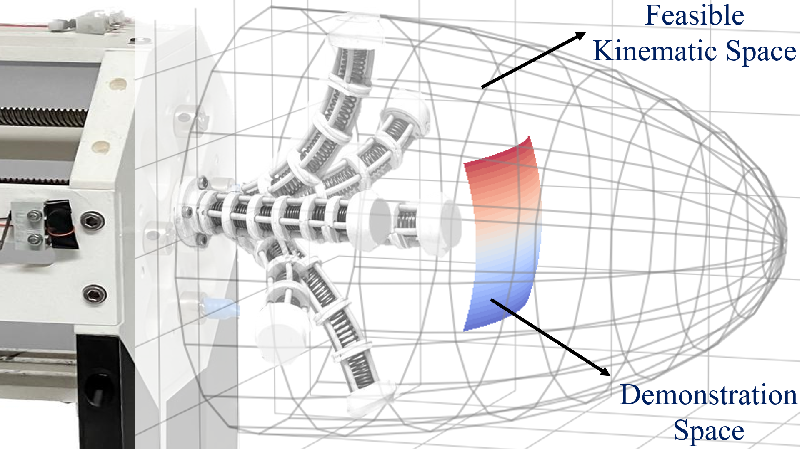
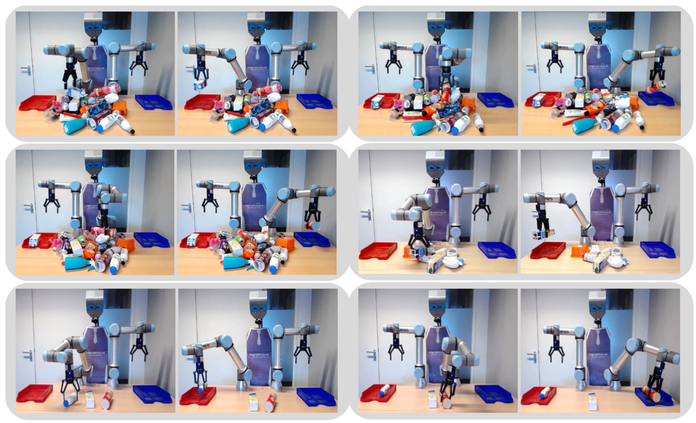

 
 

<!-- 
 -->
<!-- 
 -->
 I am a research associate (postdoc) at the [University of Edinburgh](https://www.ed.ac.uk/).  My research focuses on efficient machine learning for robotics including deep reinforcement learning and computer vision. These days, I am particularly interested in neural ODE and its applications in developing scalable imitation learning algorithms, physics-informed neural networks (PINN) to learn residual dynamics and residual actions, also deep learning approaches for visual object perception, segmentation and grasp pose prediction in highly cluttered environments. I have evaluated my works on different robotic platforms, including Nextage, robotic arms (UR5, Franka), legged robots (biped and quadruped) and soft robots. 
 <!-- 
 -->
 
 

 [Google scholar](https://scholar.google.com/citations?user=2aY06V4AAAAJ&hl=en) / [My Ph.D. contibutions](http://wiki.ieeta.pt/wiki/index.php/Mohammadreza_Kasaei) / [Linkedin](https://www.linkedin.com/in/mohammadreza-kasaei-0a891ab6/) / [AIR-Lab](https://advanced-intelligent-robotics-lab.gitlab.io/)
 
 

# Recent Works

<table style="border:hidden;cellspacing=0; cellpadding=0;">
  <tr>
    <td width = "33%"></td>
    <td width = "33%"></td>
    <td width = "33%"></td>
  </tr>
  <tr>
    <td width = "33%"></td>
    <td width = "33%"></td>
    <td width = "33%"></td>
  </tr>
  <tr>
    <td width = "33%"></td>
    <td width = "33%"></td>
    <td width = "33%"></td>
    
  </tr>
  
</table>

# Latest News
  - **September 2022:** We proposed  <b> Instance-wise Grasp Synthesis for Robotic Grasping </b>. The paper is under review. 

  - **September 2022:** We proposed  <b> Agile and Versatile Robot Locomotion via Kernel-based Residual Learning </b>. The paper is under review but the video is available online at [Here](https://youtu.be/MK_s75UpDAg). 

- **September 2022:** We proposed  <b> Data-efficient Non-parametric Modelling and Control of an Extensible Soft Manipulator </b>. The paper is under review but the video is available online at [Here](https://youtu.be/_y7LvG-JS4M). 

 - **September 2022:** We proposed  <b> Throwing Objects into A Moving Basket While Avoiding Obstacles </b>. The paper is available online at [Here](https://arxiv.org/pdf/2210.00609.pdf). 

- **July 2022:** We proposed  <b> Design, Modelling, and Control of an Extensible
Flexible Finger for Robotic Manipulation</b>. The paper is under review but the video is available online at [Here](https://youtu.be/6k-fM8i5uTo).

 - **July 2022:** We proposed  <b> MVGrasp: Real-Time Multi-View 3D Object Grasping in Highly Cluttered Environments</b>. The paper is available online at [Here](https://arxiv.org/pdf/2103.10997.pdf).

- **July 2022:**  The FCPortugal, a 3D soccer simulation team, a partnership between the universities of Aveiro and Porto, became  <b> world champion in the 3D Simulation League, in the RoboCup 2022</b>, held in Thailand. In this league, teams of 11 fully autonomous, simulated humanoid robots play football against each other. It has been my pleasure to contribute to developing walk engines that are agile and robust (final video is available online [Here](https://www.youtube.com/watch?v=foNHQF4uLXQ&ab_channel=BahiaRT) and to read more detail please click [Here](http://wiki.ieeta.pt/wiki/index.php/FC_Portugal_is_World_Champion_at_RoboCup_2022_3D_Simulation_League)). 

- **March 2022:** We proposed a framework for  <b>Learning Hybrid Locomotion Skills - Learn to Exploit Residual Dynamics and Modulate Model-based Gait Control</b>. The paper is available online at [Here](https://arxiv.org/pdf/2011.13798).

# Research and Publication

<table style="border:hidden;cellspacing=0; cellpadding=0;">

<!--  -->

  <tr>
    <th style="width:45%"></th>
    <th></th>
  </tr>

  <tr>
    <td style = ""></td>
    <td> <b> + Learning Hybrid Locomotion Skills – Learn to Exploit Residual Dynamics and Modulate Model-based Gait Control:</b>  
    

    This work aims to combine machine learning and control approaches for legged robots, and developed a hybrid framework to achieve new capabilities of balancing against external perturbations. The framework embeds a kernel which is a fully parametric closed-loop gait generator based on analytical control. On top of that, a neural network with symmetric partial data augmentation learns to automatically adjust the parameters for the gait kernel and to generate compensatory actions for all joints as the residual dynamics, thus significantly augmenting the stability under unexpected perturbations. 

  <a href="https://youtu.be/sdcREkRHk-Q"> <b>Video</b></a> &emsp; &emsp;
 <a href="https://arxiv.org/pdf/2011.13798.pdf"> <b>Paper</b></a> 
 </td>
  </tr>

<tr>
    <td style = ""></td>
    <td> <b> + MVGrasp: Real-Time Multi-View 3D Object Grasping in Highly Cluttered Environments:</b>  
    

In this work, we propose a multi-view deep learning approach to handle robust object grasping in human-centric domains. In particular, our approach takes a point cloud of an arbitrary object as an input, and then, generates orthographic views of the given object. The obtained views are finally used to estimate pixel-wise grasp synthesis for each object. We train the model end-to-end using a synthetic object grasp dataset and test it on both simulation and real-world data without any further fine-tuning.

  <a href="https://youtu.be/r7Ra8BJsAY4"> <b>Video</b></a> &emsp; &emsp;
 <a href="https://arxiv.org/pdf/2103.10997.pdf"> <b>Paper</b></a> 
 </td>
  </tr>

<tr>
    <td style = ""></td>
    <td> <b> + Throwing Objects into A Moving Basket While Avoiding Obstacles:</b>  
    

 In this work, we tackle object throwing problem through a deep reinforcement learning approach that enables robots to precisely throw objects into moving baskets while there are obstacles obstructing the path. To the best of our knowledge, we are the first group that addresses throwing
objects with obstacle avoidance. Such a throwing skill not only increases the physical reachability of a robot arm but also improves the execution time.

  <a href="https://youtu.be/VmIFF__c_84"> <b>Video</b></a> &emsp; &emsp;
 <a href="https://arxiv.org/pdf/2210.00609.pdf"> <b>Paper</b></a> 
 </td>
  </tr>

<tr>
    <td style = ""></td>
    <td> <b> + Design, Modelling, and Control of an Extensible Flexible Finger for Robotic Manipulation:</b>  
    
  This work presents a novel cable-driven soft robot capable of flexing in 3D space with an additional degree of freedom for extension and retraction. In comparison with non-extensible soft robots, the proposed robot provides a larger workspace to reach 3D targeted points. We detail the robot design and prototyping, develop a novel mathematical model for predicting the robot's motion, and employ the model to control the robot that can autonomously follow time-varying trajectories.

  <a href="https://youtu.be/_y7LvG-JS4M"> <b>Video</b></a> &emsp; &emsp;
 <!-- <a href="https://arxiv.org/pdf/2210.00609.pdf"> <b>Paper</b></a>  -->
 </td>
  </tr>

<tr>
    <td style = ""></td>
    <td> <b> + Data-efficient Non-parametric Modelling and Control of an Extensible Soft Manipulator:</b>  
    
 This work proposed a novel data-efficient and non-parametric approach to develop a continuous model using a small dataset of real robot demonstrations (only 25 points). To the best of our knowledge, the proposed approach is the most sample-efficient method for soft continuum robot. Furthermore, we employed this model to develop a  controller to track arbitrary trajectories in the feasible kinematic space. 

  <a href="https://youtu.be/_y7LvG-JS4M"> <b>Video</b></a> &emsp; &emsp;
 <!-- <a href="https://arxiv.org/pdf/2210.00609.pdf"> <b>Paper</b></a>  -->
 </td>
  </tr>

<tr>
    <td style = ""></td>
    <td> <b> + Agile and Versatile Robot Locomotion via Kernel-based Residual Learning:</b>  
    
 This work developed a kernel-based residual learning framework for quadrupedal robotic locomotion. Initially, a kernel neural network is trained with data collected from an MPC controller. Alongside a frozen kernel network, a residual controller network is trained via reinforcement learning to acquire generalized locomotion skills and resilience against external perturbations. With this proposed framework, a robust quadrupedal locomotion controller is learned with high sample efficiency and controllability, providing omnidirectional locomotion at continuous velocities. Its versatility and robustness are validated on unseen terrains that the expert MPC controller fails to traverse. Furthermore, the learned kernel can produce a range of functional locomotion behaviors and can generalize to unseen gaits.

  <a href="https://youtu.be/MK_s75UpDAg"> <b>Video</b></a> &emsp; &emsp;
 <!-- <a href="https://arxiv.org/pdf/2210.00609.pdf"> <b>Paper</b></a>  -->
 </td>
  </tr>

<tr>
    <td style = ""></td>
    <td> <b> + Instance-wise Grasp Synthesis for Robotic Grasping:</b>  
    
 Generating high-quality instance-wise grasp configurations provides critical information of how to grasp specific objects in a multi-object environment and is of high importance for robot manipulation tasks. This work proposed a novel Single-Stage Grasp (SSG) synthesis network, which performs high-quality instance-wise grasp synthesis in a single stage: instance mask and grasp configurations are generated for each object simultaneously. Our method outperforms state-of-the-art on robotic grasp prediction based on the OCID-Grasp dataset, and performs competitively on the JACQUARD dataset. The benchmarking results showed significant improvements compared to the baseline on the accuracy of generated grasp configurations. 

  
<!-- <a href="https://youtu.be/MK_s75UpDAg"> <b>Video</b></a> &emsp; &emsp; -->
 <!-- <a href="https://arxiv.org/pdf/2210.00609.pdf"> <b>Paper</b></a>  -->
 </td>
  </tr>

</table>

# Contact
Dr.Mohammadreza Kasaei\
Bayes Centre - G1.10\
47 Potterrow\
Edinburgh\
EH8 9BT\
Email: m.kasaei@ed.ac.uk