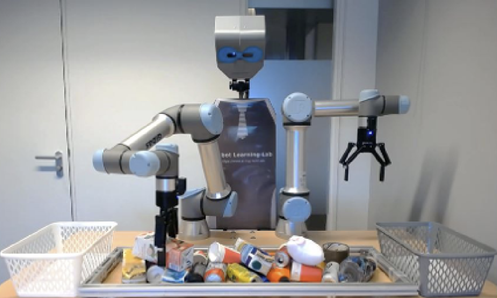

 
 

<!-- 
 -->

 I am a research associate (postdoc) at the [University of Edinburgh](https://www.ed.ac.uk/).  My research focuses on efficient machine learning for robotics including deep reinforcement learning and computer vision. These days, I am particularly interested in neural ODE and its applications in developing scalable imitation learning algorithms, physics-informed neural networks (PINN) to learn residual dynamics and residual actions, also deep learning approaches for visual object perception, segmentation and grasp pose prediction in highly cluttered environments. I have evaluated my works on different robotic platforms, including Nextage, robotic arms (UR5, Franka), legged robots (biped and quadruped) and soft robots. 
 

 
 

 [Google scholar](https://scholar.google.com/citations?user=2aY06V4AAAAJ&hl=en) / [My Ph.D. contibutions](http://wiki.ieeta.pt/wiki/index.php/Mohammadreza_Kasaei) / [Linkedin](https://www.linkedin.com/in/mohammadreza-kasaei-0a891ab6/) / [AIR-Lab](https://advanced-intelligent-robotics-lab.gitlab.io/)
 
 

# Recent Works

<table style="border:hidden;cellspacing=0; cellpadding=0;">
  <tr>
    <td width = "33%"></td>
    <td width = "33%"></td>
    <td width = "33%"></td>
  </tr>
  <tr>
    <td width = "33%"></td>
    <td width = "33%"></td>
    <td width = "33%"></td>
  </tr>
  <tr>
    <td width = "33%"></td>
    <td width = "33%"></td>
    <td width = "33%"></td>
    
  </tr>
  
</table>

# Latest News
  
 - **March 2022:** We proposed a framework for  <b>Learning Hybrid Locomotion Skills - Learn to Exploit Residual Dynamics and Modulate Model-based Gait Control</b>. The paper is available online at [Here](https://arxiv.org/pdf/2011.13798).

 - **July 2022:** We proposed  <b> MVGrasp: Real-Time Multi-View 3D Object Grasping in Highly Cluttered Environments</b>. The paper is available online at [Here](https://arxiv.org/pdf/2103.10997.pdf).

# Research and Publication

<table style="border:hidden;cellspacing=0; cellpadding=0;">

<!--  -->

  <tr>
    <th style="width:45%"></th>
    <th></th>
  </tr>

  <tr>
    <td style = ""></td>
    <td> <b> + Learning Hybrid Locomotion Skills – Learn to Exploit Residual Dynamics and Modulate Model-based Gait Control:</b>  
    

    This work aims to combine machine learning and control approaches for legged robots, and developed a hybrid framework to achieve new capabilities of balancing against external perturbations. The framework embeds a kernel which is a fully parametric closed-loop gait generator based on analytical control. On top of that, a neural network with symmetric partial data augmentation learns to automatically adjust the parameters for the gait kernel and to generate compensatory actions for all joints as the residual dynamics, thus significantly augmenting the stability under unexpected perturbations. 

  <a href="https://youtu.be/sdcREkRHk-Q"> <b>Video</b></a> &emsp; &emsp;
 <a href="https://arxiv.org/pdf/2011.13798.pdf"> <b>Paper</b></a> 
 </td>
  </tr>

<tr>
    <td style = ""></td>
    <td> <b> + MVGrasp: Real-Time Multi-View 3D Object Grasping in Highly Cluttered Environments:</b>  
    

Nowadays robots play an increasingly important role in our daily life. In human-centered environments, robots often encounter piles of objects, packed items, or isolated objects. Therefore, a robot must be able to grasp and manipulate different objects in various situations to help humans with daily tasks. In this paper, we propose a multi-view deep learning approach to handle robust object grasping in human-centric domains. In particular, our approach takes a point cloud of an arbitrary object as an input, and then, generates orthographic views of the given object. The obtained views are finally used to estimate pixel-wise grasp synthesis for each object. We train the model end-to-end using a synthetic object grasp dataset and test it on both simulation and real-world data without any further fine-tuning.

  <a href="https://youtu.be/r7Ra8BJsAY4"> <b>Video</b></a> &emsp; &emsp;
 <a href="https://arxiv.org/pdf/2103.10997.pdf"> <b>Paper</b></a> 
 </td>
  </tr>

</table>

# Contact
Dr.Mohammadreza Kasaei\
Bayes Centre - G1.10\
47 Potterrow\
Edinburgh\
EH8 9BT\
Email: m.kasaei@ed.ac.uk