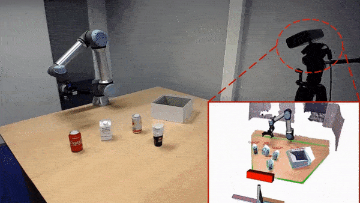

<!--  
  -->

<!-- 
 -->
<!-- 
 -->
 I am a research associate (postdoc) at the [University of Edinburgh](https://www.ed.ac.uk/).  My research focuses on efficient machine learning for robotics including deep reinforcement learning and computer vision. These days, I am particularly interested in neural ODE and its applications in developing scalable imitation learning algorithms, physics-informed neural networks (PINN) to learn residual dynamics and residual actions, also deep learning approaches for visual object perception, segmentation and grasp pose prediction in highly cluttered environments. I have evaluated my works on different robotic platforms, including Nextage, robotic arms (UR5, Franka), legged robots (biped and quadruped) and soft robots. 
 <!-- 
 -->
 
 

 [Google scholar](https://scholar.google.com/citations?user=2aY06V4AAAAJ&hl=en) / [My Ph.D. contibutions](http://wiki.ieeta.pt/wiki/index.php/Mohammadreza_Kasaei) / [Linkedin](https://www.linkedin.com/in/mohammadreza-kasaei-0a891ab6/) / [AIR-Lab](https://advanced-intelligent-robotics-lab.gitlab.io/)
 
 

# Recent Works

<table style="border:hidden;cellspacing=0; cellpadding=0;">
  <tr>
    <td width = "33%"></td>
    <td width = "33%"></td>
    <td width = "33%"></td>
  </tr>
  <tr>
    <td width = "33%"></td>
    <td width = "33%"></td>
    <td width = "33%"></td>
  </tr>
  <tr>
    <!-- <td width = "33%"></td> -->
    <td width = "33%"></td>
    <td width = "33%"></td>
    <td width = "33%"></td>
    
  </tr>
  
</table>

# Latest News
 - **August 2023:** Our paper entitled  <b> A Data-efficient Neural ODE Framework for Optimal Control of Soft Manipulators </b> got accepted for presentation at [**(CoRL 2023)**](https://www.corl2023.org/). The paper is available online [Here](https://openreview.net/pdf?id=PalhNjBJqv).
 
 - **August 2023:**  Our paper entitled  <b>Language-guided Robot Grasping: CLIP-based Referring Grasp Synthesis in Clutter </b> got accepted for presentation at [**(CoRL 2023)**](https://www.corl2023.org/). The paper is available online [Here](https://openreview.net/pdf?id=j2AQ-WJ_ze).
 
 
  
  - **July 2023:** We proposed  <b> Learning Fine Pinch-Grasp Skills using Tactile Sensing from Real Demonstration Data</b>. The paper is available online [Here](https://arxiv.org/abs/2307.04619).
  
  - **June 2023:** Our poster,  <b> A Novel Extensible Flexible Arm for Robotic </b> got the best poster award in [Soft Growing Robots:](https://www.growing-robots.com/) From Search-and-Rescue to Intraluminal Interventions in [(**ICRA 2023**)](https://www.icra2023.org/).  

  - **March 2023:** We proposed  <b> Controllable Video Generation by Learning the Underlying Dynamical System with Neural ODE </b>. The paper is available online [Here](https://arxiv.org/pdf/2303.05323.pdf).
  
  - **March 2023:** Our paper entitled   <b> Learning Hybrid Locomotion Skills -Learn to Exploit Residual Actions and Modulate Model-based Gait Control</b> got accepted to Frontiers Robotics and AI!

  - **February 2023:** Mohammadreza Kasaei gave a talk at IPAB workshop in the University of Edinburgh, UK entitled **Data-efficient Non-parametric Modelling and Control of an Extensible Soft Manipulator**.
  
  - **January 2023:** My research team has had four papers accepted for presentation at the 2023 International Conference on Robotics and Automation [(**ICRA 2023**)](https://www.icra2023.org/). 
  
  - **November 2022:**: Mohammadreza Kasaei gave an invited talk at the University of Aveiro, Portugal in a Seminar in Robotics and Intelligent Systems on Robotics for Society: Recent Research in Locomotion and Manipulation.
  
  - **October 2022:** Our paper entitled   <b> MVGrasp: Real-Time Multi-View 3D Object Grasping in Highly Cluttered Environments</b> got accepted to Robotics and Autonomous Systems (RAS)!!

  - **September 2022:** We proposed  <b> Instance-wise Grasp Synthesis for Robotic Grasping </b>. The paper has been accepted at [(**ICRA 2023**)](https://www.icra2023.org/). 

  - **September 2022:** We proposed  <b> Agile and Versatile Robot Locomotion via Kernel-based Residual Learning </b>. The paper has been accepted at [(**ICRA 2023**)](https://www.icra2023.org/), the video is available online [Here](https://youtu.be/MK_s75UpDAg). 

- **September 2022:** We proposed  <b> Data-efficient Non-parametric Modelling and Control of an Extensible Soft Manipulator </b>.  The paper has been accepted at [(**ICRA 2023**)](https://www.icra2023.org/) and the video is available online [Here](https://youtu.be/_y7LvG-JS4M). 

 - **September 2022:** We proposed  <b> Throwing Objects into A Moving Basket While Avoiding Obstacles </b>. This paper has been accepted at [(**ICRA 2023**)](https://www.icra2023.org/). The paper is available online [Here](https://arxiv.org/pdf/2210.00609.pdf) and the video can be watched at [Here](https://youtu.be/VmIFF__c_84) 

- **July 2022:** We proposed  <b> Design, Modelling, and Control of an Extensible
Flexible Finger for Robotic Manipulation</b>. The paper is under review but the video is available online [Here](https://youtu.be/6k-fM8i5uTo).

 - **July 2022:** We proposed  <b> MVGrasp: Real-Time Multi-View 3D Object Grasping in Highly Cluttered Environments</b>. The paper is available online [Here](https://arxiv.org/pdf/2103.10997.pdf).

- **July 2022:**  The FCPortugal, a 3D soccer simulation team, a partnership between the universities of Aveiro and Porto, became  <b> world champion in the 3D Simulation League, in the RoboCup 2022</b>, held in Thailand. In this league, teams of 11 fully autonomous, simulated humanoid robots play football against each other. It has been my pleasure to contribute to developing walk engines that are agile and robust (final video is available online [Here](https://www.youtube.com/watch?v=foNHQF4uLXQ&ab_channel=BahiaRT) and to read more detail please click [Here](http://wiki.ieeta.pt/wiki/index.php/FC_Portugal_is_World_Champion_at_RoboCup_2022_3D_Simulation_League)). 

<!-- - **March 2022:** We proposed a framework for  <b>Learning Hybrid Locomotion Skills - Learn to Exploit Residual Dynamics and Modulate Model-based Gait Control</b>. The paper is available online [Here](https://arxiv.org/pdf/2011.13798). -->

# Research and Publication

<table style="border:hidden;cellspacing=0; cellpadding=0;">

<!--  -->

  <tr>
    <th style="width:45%"></th>
    <th></th>
  </tr>

<tr>
    <td style = ""></td>
    <td> <b> + Language-guided Robot Grasping: CLIP-based Referring Grasp Synthesis in Clutter:</b>  
    

    Robots operating in human-centric environments require the integration of visual grounding and grasping capabilities to effectively manipulate objects based on user instructions. This work focuses on the task of referring grasp synthesis, which predicts a grasp pose for an object referred through natural language in cluttered scenes. Existing approaches often employ multi-stage pipelines that first segment the referred object and then propose a suitable grasp, and are evaluated in simple datasets or simulators that do not capture the complexity of natural indoor scenes. To address these limitations, we develop a challenging benchmark based on cluttered indoor scenes from OCID dataset, for which we generate referring expressions and connect them with 4-DoF grasp poses. Further, we propose a novel end-to-end model (CROG) that leverages the visual grounding capabilities of CLIP to learn grasp synthesis directly from image-text pairs. Our results show that vanilla integration of CLIP with pretrained models transfers poorly in our challenging benchmark, while CROG achieves significant improvements both in terms of grounding and grasping. 
    Extensive robot experiments in both simulation and hardware demonstrate the effectiveness of our approach in challenging interactive object grasping scenarios that include clutter.

  <a href="https://youtu.be/6tYS-5tkoQg"> <b>Video</b></a> &emsp; &emsp;
 <a href="https://openreview.net/pdf?id=j2AQ-WJ_ze"> <b>Paper</b></a>  

 </td>
  </tr>

<tr>
    <td style = ""></td>
    <td> <b> + A Data-efficient Neural ODE Framework for Optimal Control of Soft Manipulators:</b>  
    

    This work introduces a novel approach for modeling continuous forward kinematic models of soft continuum robots by employing Augmented Neural ODE (ANODE), a cutting-edge family of deep neural network models. To the best of our knowledge, this is the first application of ANODE in modeling soft continuum robots. This formulation introduces auxiliary dimensions, allowing the system's states to evolve in the augmented space which provides a richer set of dynamics that the model can learn, increasing the flexibility and accuracy of the model. Our methodology achieves exceptional sample efficiency, training the continuous forward kinematic model using only 25 scattered data points.
 Additionally, we design and implement a fully parallel Model Predictive Path Integral~(MPPI)-based controller running on a GPU, which efficiently manages a non-convex objective function. Through a set of experiments, we showed that the proposed framework (ANODE+MPPI) significantly outperforms state-of-the-art learning based methods such as FNN and RNN in unseen-before scenarios and marginally outperforms them in seen-before scenarios.

  <a href="https://youtu.be/6tYS-5tkoQg"> <b>Video</b></a> &emsp; &emsp;
 <a href="https://openreview.net/pdf?id=PalhNjBJqv"> <b>Paper</b></a>  &emsp;
 <a href="https://github.com/MohammadKasaei/SoftRobotSimulator"> <b>Code</b></a> 
 </td>
  </tr>

<tr>
    <td style = ""></td>
    <td> <b> + Learning Fine Pinch-Grasp Skills using Tactile Sensing from Real Demonstration Data:</b>  
    

This work develops a data-efficient learning from demonstration framework which exploits the use of rich tactile sensing and achieves fine dexterous bimanual manipulation. Specifically, we formulated a convolutional autoencoder network that can effectively extract and encode high-dimensional tactile information. Further, we developed a behaviour cloning network that can learn human-like sensorimotor skills demonstrated directly on the robot hardware in the task space by fusing both proprioceptive and tactile feedback. Our comparison study with the baseline method revealed the effectiveness of the contact information, which enabled successful extraction and replication of the demonstrated motor skills.

  <a href="https://youtu.be/4Pg29bUBKqs"> <b>Video</b></a> &emsp; &emsp;
 <a href="https://arxiv.org/pdf/2307.04619.pdf"> <b>Paper</b></a> 
 </td>
  </tr>

<tr>
    <td style = ""></td>
    <td> <b> + Controllable Video Generation by Learning the Underlying Dynamical System
with Neural ODE:</b>  
    

The work introduces a novel framework, named TiV-ODE, which enables the generation of highly controllable videos using a static image and text caption. The framework relies on the Neural Ordinary Differential Equations (Neural ODEs) to represent complex underlying dynamical systems through a set of nonlinear ordinary differential equations. The proposed method generates videos that possess both the desired dynamics and content. The experimental results demonstrate the effectiveness of the approach in producing visually consistent and highly controllable videos while modeling dynamical systems. This work represents a significant advancement towards developing advanced models for generating controllable videos that can handle complex and dynamic scenes.

<!--   <a href="https://youtu.be/4Pg29bUBKqs"> <b>Video</b></a> &emsp; &emsp; -->
 <a href="https://arxiv.org/pdf/2303.05323.pdf"> <b>Paper</b></a> 
 </td>
  </tr>

<tr>
    <td style = ""></td>
    <td> <b> + MVGrasp: Real-Time Multi-View 3D Object Grasping in Highly Cluttered Environments:</b>  
    

In this work, we propose a multi-view deep learning approach to handle robust object grasping in human-centric domains. In particular, our approach takes a point cloud of an arbitrary object as an input, and then, generates orthographic views of the given object. The obtained views are finally used to estimate pixel-wise grasp synthesis for each object. We train the model end-to-end using a synthetic object grasp dataset and test it on both simulation and real-world data without any further fine-tuning.

  <a href="https://youtu.be/r7Ra8BJsAY4"> <b>Video</b></a> &emsp; &emsp;
 <a href="https://arxiv.org/pdf/2103.10997.pdf"> <b>Paper</b></a> 
 </td>
  </tr>

<tr>
    <td style = ""></td>
    <td> <b> + Throwing Objects into A Moving Basket While Avoiding Obstacles:</b>  
    

 In this work, we tackle object throwing problem through a deep reinforcement learning approach that enables robots to precisely throw objects into moving baskets while there are obstacles obstructing the path. To the best of our knowledge, we are the first group that addresses throwing
objects with obstacle avoidance. Such a throwing skill not only increases the physical reachability of a robot arm but also improves the execution time.

  <a href="https://youtu.be/VmIFF__c_84"> <b>Video</b></a> &emsp; &emsp;
 <a href="https://arxiv.org/pdf/2210.00609.pdf"> <b>Paper</b></a> 
 </td>
  </tr>

<tr>
    <td style = ""></td>
    <td> <b> + Design, Modelling, and Control of an Extensible Flexible Finger for Robotic Manipulation:</b>  
    
  This work presents a novel cable-driven soft robot capable of flexing in 3D space with an additional degree of freedom for extension and retraction. In comparison with non-extensible soft robots, the proposed robot provides a larger workspace to reach 3D targeted points. We detail the robot design and prototyping, develop a novel mathematical model for predicting the robot's motion, and employ the model to control the robot that can autonomously follow time-varying trajectories.

  <a href="https://youtu.be/_y7LvG-JS4M"> <b>Video</b></a> &emsp; &emsp;
 <!-- <a href="https://arxiv.org/pdf/2210.00609.pdf"> <b>Paper</b></a>  -->
 </td>
  </tr>

<tr>
    <td style = ""></td>
    <td> <b> + Data-efficient Non-parametric Modelling and Control of an Extensible Soft Manipulator:</b>  
    
 This work proposed a novel data-efficient and non-parametric approach to develop a continuous model using a small dataset of real robot demonstrations (only 25 points). To the best of our knowledge, the proposed approach is the most sample-efficient method for soft continuum robot. Furthermore, we employed this model to develop a  controller to track arbitrary trajectories in the feasible kinematic space. 

  <a href="https://youtu.be/_y7LvG-JS4M"> <b>Video</b></a> &emsp; &emsp;
 <a href="https://ieeexplore.ieee.org/document/10161275"> <b>Paper</b></a> 
 </td>
  </tr>

<tr>
    <td style = ""></td>
    <td> <b> + Agile and Versatile Robot Locomotion via Kernel-based Residual Learning:</b>  
    
 This work developed a kernel-based residual learning framework for quadrupedal robotic locomotion. Initially, a kernel neural network is trained with data collected from an MPC controller. Alongside a frozen kernel network, a residual controller network is trained via reinforcement learning to acquire generalized locomotion skills and resilience against external perturbations. With this proposed framework, a robust quadrupedal locomotion controller is learned with high sample efficiency and controllability, providing omnidirectional locomotion at continuous velocities. Its versatility and robustness are validated on unseen terrains that the expert MPC controller fails to traverse. Furthermore, the learned kernel can produce a range of functional locomotion behaviors and can generalize to unseen gaits.

  <a href="https://youtu.be/MK_s75UpDAg"> <b>Video</b></a> &emsp; &emsp;
 <a href="https://arxiv.org/pdf/2302.07343.pdf"> <b>Paper</b></a> 
 </td>
  </tr>

<tr>
    <td style = ""></td>
    <td> <b> + Instance-wise Grasp Synthesis for Robotic Grasping:</b>  
    
 Generating high-quality instance-wise grasp configurations provides critical information of how to grasp specific objects in a multi-object environment and is of high importance for robot manipulation tasks. This work proposed a novel Single-Stage Grasp (SSG) synthesis network, which performs high-quality instance-wise grasp synthesis in a single stage: instance mask and grasp configurations are generated for each object simultaneously. Our method outperforms state-of-the-art on robotic grasp prediction based on the OCID-Grasp dataset, and performs competitively on the JACQUARD dataset. The benchmarking results showed significant improvements compared to the baseline on the accuracy of generated grasp configurations. 

  
<a href="https://youtu.be/riBXMgrupUw"> <b>Video</b></a> &emsp; &emsp;
 <a href="https://arxiv.org/pdf/2302.07824.pdf"> <b>Paper</b></a> 
 </td>
  </tr>

  <tr>
    <td style = ""></td>
    <td> <b> + FC Portugal: RoboCup 2022 3D Simulation League and Technical Challenge Champions:</b>  
    

     FC Portugal, a team from the universities of Porto and Aveiro, won the main competition of the **2022 RoboCup 3D Simulation League**, with 17 wins, 1 tie and no losses. During the course of the competition, the team scored 84 goals while conceding only 2. FC Portugal also won the 2022 RoboCup 3D Simulation League Technical Challenge, accumulating the maximum amount of points by ending first in its both events: the Free/Scientific Challenge, and the Fat Proxy Challenge. The team presented in this year’s competition was rebuilt from the ground up since the last RoboCup. No previous code was used or adapted, with the exception of the 6D pose estimation algorithm, and the get-up behaviors, which were re-optimized. In comparison with our previous team, the omnidirectional walk is more stable and went from 0.70 m/s to 0.90 m/s, the long kick from 15 m to 19 m, and the new close-control dribble reaches up to 1.41 m/s.
   

  <a href="https://www.youtube.com/live/foNHQF4uLXQ?feature=share"> <b>Video</b></a> &emsp; &emsp;
  <a href="https://www.springerprofessional.de/en/fc-portugal-robocup-2022-3d-simulation-league-and-technical-chal/24669132"> <b>Paper</b></a> &emsp; &emsp;<a href="https://archive.robocup.info/Soccer/Simulation/3D/TDPs/RoboCup/2022/FCPortugal_SS3D_RC2022_TDP.pdf"> <b>TDP</b></a> 
 </td>
  </tr>

  <tr>
    <td style = ""></td>
    <td> <b> + Learning Hybrid Locomotion Skills – Learn to Exploit Residual Dynamics and Modulate Model-based Gait Control:</b>  
    

    This work aims to combine machine learning and control approaches for legged robots, and developed a hybrid framework to achieve new capabilities of balancing against external perturbations. The framework embeds a kernel which is a fully parametric closed-loop gait generator based on analytical control. On top of that, a neural network with symmetric partial data augmentation learns to automatically adjust the parameters for the gait kernel and to generate compensatory actions for all joints as the residual dynamics, thus significantly augmenting the stability under unexpected perturbations. 

  <a href="https://youtu.be/sdcREkRHk-Q"> <b>Video</b></a> &emsp; &emsp;
 <a href="https://arxiv.org/pdf/2011.13798.pdf"> <b>Paper</b></a> 
 </td>
 
  </tr>

</table>

# Contact
Dr.Mohammadreza Kasaei\
Bayes Centre - G1.10\
47 Potterrow\
Edinburgh\
EH8 9BT\
Email: m.kasaei[at]ed.ac.uk